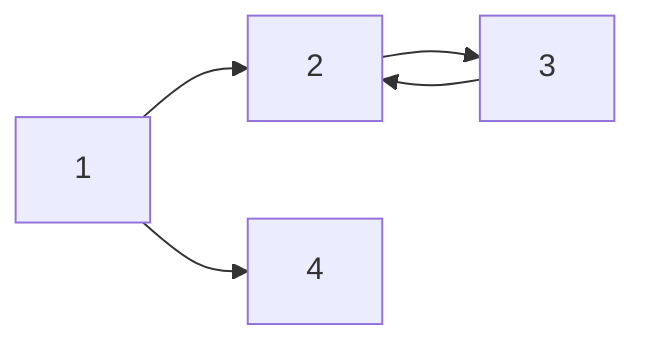

hello

## hello
### hello

# H1 tag
## H2 tag
### H3 tag
#### H4 tag

---

_italic_
**bold**
**_italic + bold_**
~~cancle~~
> This is Quote

---

- ulist 1
- ulist 2
  - ulist 2-1
  - ulist 2-2

1. olist 1
2. olist 2
  2-1. olist 2-1
  2-2. olist 2-2

---

|Header1|Header2|Header3|
|-|-|-|
|body1|body2|body3|

---

[링크이름](링크주소)
[Google](google.com)

<a href="google.com">Google</a>


---

this is `inline code` block.

```python
import os

def func:
    print("hello markdown")
    pass
```

---

$a+b=c$

$a^2_1 + b^2_1 = c^2_1$

it can be $i$nline

$$(\alpha + \beta)^2 = \alpha^2 + 2\alpha \beta + \beta^2$$

---

