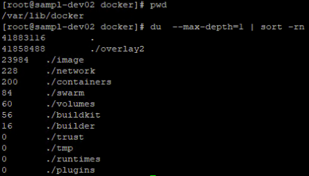

# Docker 용량 정리

## Docker Root Dir

- 기본 Docker Root Dir 의 경로는 `/var/lib/docker`
	- 확인하려면 `docker info | grep Root` 해보기
- `docker system df` 로 현재 디스크 사용 정보 확인
- {ROOT_DIR} 에서 `du --max-depth=1 | sort -rn` 로 각 디렉토리의 하위 총 용량 합 순 정렬해서 어떤 공간이 많이 차지하는지 확인

## Container

- 현재 실행중인 컨테이너별 작업 공간
- 컨테이너 별 stdout 과 stderr 의 출력을 로깅
- `${ROOT_DIR}/containers/<CONTAINER_ID>/<CONTAINER_ID>-json.log` 형식으로 관리

- 로그 파일이 크면 `truncate -s 0 /PATH/TO/LOGFILE` 같은 방식으로 전체 삭제하거나 판단해서 줄이기
- `/etc/docker/daemon.json` 에 log-opts 로 max-size 같은걸 설정하여 일괄 적용을 하거나 컨테이너 실행 옵션을 추가하여 로그가 무한정 생성되지 않도록 하자…

- 참조: https://sematext.com/guides/docker-logs/

## overlay2

- overlay2는 별도 구성을 하지 않은 모든 Linux 배포판에 대한 [스토리지 드라이버](https://docs.docker.com/storage/storagedriver/overlayfs-driver/)와 관련된 공간
- 일반적으로 overlay2 디렉토리 하위엔 Container Layer 와 관련된 디렉토리가 존재
- 주로 용량을 차지하는 부분은 레이어 별 내부 파일 구조의 변경 사항을 기록하는 `<LAYER_HASH>/diff/tmp` 디렉토리

## image

- 도커 이미지와 관련된 공간
- 불필요한 캐시나 사용되지 않는 댕글링 이미지가 용량 차지의 주 원인
- `docker image prune --all` 로 이미지 관련 정리 수행

> [!warning] 최종 수단으로 `docker system prune -a --volume` 으로 종합 정리를 할 수있으나… 생각없이 수행하진 말자

참조: https://cryptosalamander.tistory.com/127
