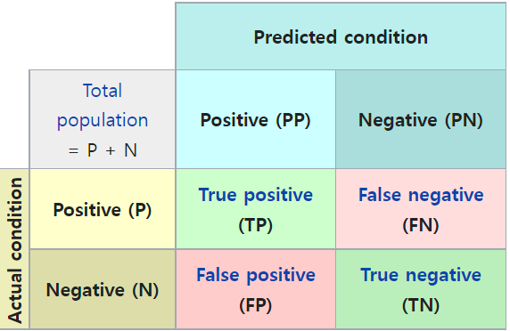

# 개요

- 
- 출처: [Confusion matrix - Wikipedia](https://en.wikipedia.org/wiki/Confusion_matrix)
- Case
    - TP (True Positive) : 실제 True인 정답을 True라고 예측 (정답)
    - FP (False Positive) : 실제 False인 정답을 True라고 예측 (오답)
    - FN (False Negative) : 실제 True인 정답을 False라고 예측 (오답)
    - TN (True Negative) : 실제 False인 정답을 False라고 예측 (정답)

# Precision (정밀도)

- 모델이 True 라 예측한 것 중 실제 True 의 비율
- Positive 정답률 (PPV, Positive Predictive Value) 라고도 함
- $Precision = {TP \over TP+FP} = {1-FDR}$

# Recall (재현율)

- 실제 True 인 것 중 모델이 True 라고 예측한 것의 비율
- sensitivity, hit rate, true positive rate (TPR) 라고도 함
- $Recall = {TP \over P} = {TP \over TP + FN} = 1-FNR$

# Accuracy (정확도)

- 실제 True 를 True 라 예측하는 경우와 실제 False 를 False 라 예측한 것의 비율
- $Accuracy = {TP + TN \over TP + FN + FP + TN}$

# F1 Score

- Precision 과 Recall 의 조화 평균
- 
- $F1-score = {2 \times {1 \over {1 \over Precision} + {1 \over Recall}}} = {2 \times {{Precision \times Recall} \over {Precision + Recall}}}$

# Fall-out

- 실제 False 인 Data 중에서 True 라고 잘못 예측한 비율
- FPR(False Positive Rate)로도 불림
- $FPR = {FP \over TN + FP}$

# ROC (Receiver Operating Characteristic) Curve

- 여러 임계값을 기준으로 Recall-Fallout 의 변화를 시각화한 것
- Fall-out과 Recall을 각각 x, y 축으로 놓고 그려지는 그래프
- Curve가 y=x 그래프 보다 상단에 위치해야 어느정도 성능이 있다고 말하며, 좌상단 모서리에 가까울수록 성능이 좋다고 평가함
- 
- 출처: [ROC curve analysis (medcalc.org)](https://www.medcalc.org/manual/roc-curves.php)

# AUC (Area Under Curve)

- ROC Curve는 그래프라 명확한 수치비교가 어려움
- 그래프 아래의 면적값을 이용
- 최대값은 1이고 (Fall-out에 비해 Recall 값이 클수록) 1에 가까울수록 좋은 모델
