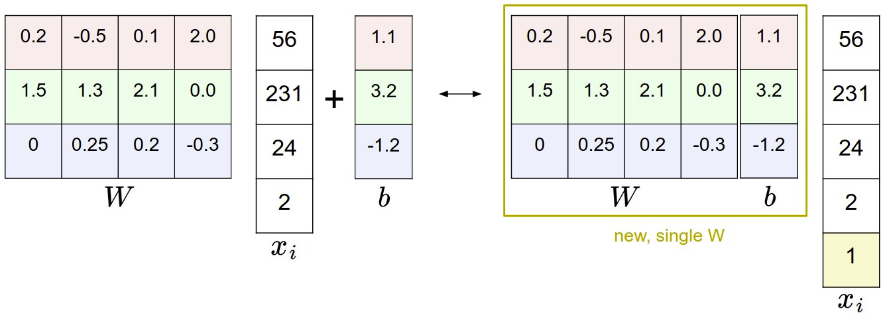
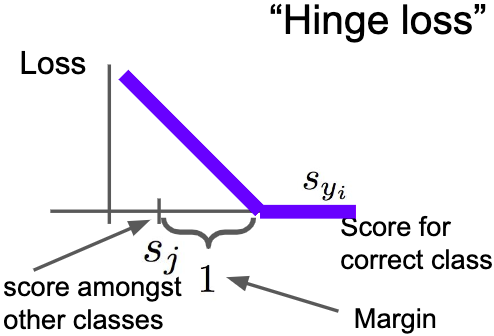
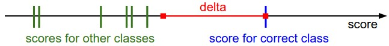

> [!info] [CS231n] Convolutional Neural Networks for Visual Recognition from Stanford University 과정

# Image Classification

## Image Classification의 어려움

- Viewpoint Variation (시점 변환) : 객체의 단일 인스턴스는 카메라 시점에 따라 다르게 보일 수 있음
- Scale Variation (크기 변환) : 비주얼 클래스들은 대부분 크기의 변화가 나타남 (이미지에서 뿐만 아니라 실제 세계에서의 크기까지 포함)
- Deformation (변형) : 많은 객체들은 고정된 형태가 없고, 극단적인 형태로 변형 될 수 있음
- Occlusion (폐색) : 객체들은 전체가 보이지 않을 수 있음. 때로는 객체의 매우 적은 부분(픽셀 수준)만 보임
- Illumiation Conditions (조명 상태) : 조명 효과는 픽셀 수준에서 영향을 미침
- Background Clutter (배경 분규) : 객체가 주변 환경에 섞여(blend) 알아보기 힘들게 됨
- Intra-Class Variation (내부클래스의 다양성) : 분류해야할 클래스의 범위가 큰 것이 많음. 예를 들어 의자는 매우 다양한 형태의 객체가 있음
- 
- 
> [!info] 데이터 기반 접근 방식(Data-driven approach)이란?
> 고양이 이미지를 분류하는 알고리즘을 작성하는 방법은 숫자를 정렬하는 알고리즘과 달리 명확하지 않음. 따라서 분류하기 위한 코드를 직접 작성하는 대신, 레이블링을 한 많은 고양이 이미지(데이터)를 제공하고 이를 통해 학습시키는 방식, 즉, 훈련데이터에 의존하는 방식을 데이터 기반 접근 방식이라 함

## 벡터 간 거리와 선택

- L1(Mangattan) Distance = L1 Norm (절대값 차의 총합)
	- $d_1(I_1, I_2) = \sum_p |I_1^p - I_2^p|$
- L2(Euclidean) Distance = L2 Norm (두 벡터 간의 거리)
	- $d_2(I_1, I_2)= \sqrt{\sum_p(I_1^p-I_2^p)^2}$
- L1 vs. L2
    - L2는 거리의 차이가 큰 경우 더 크게 반응함 (더 큰 오차가 발생할 때 더 많은 패널티)

> [!info] 단조함수(Monotonic Function)란?

- 주어진 순서를 보존하는 함수 (단조 증가, 단조 감소)
- 제곱근 (sqrt는 단조 함수)

## k-Nearest Neighbor (kNN) Classifier

- 가장 가까운 k 개의 이미지를 잡아서 레이블을 결정
- k=1 인경우 주어진 데이터에서만 결정이 가능
- k 값이 커질수록 이상점(outlier)에 강하고 분류 경계가 부드러워짐
- 
    - 색칠된 부분은 L2 거리를 사용해 구해진 결정 경계(decision boundaries)
    - NN은 애매한 결정 경계가 많이 보이지만 5NN은 결정 경계가 부드럽게 나눠지는 것을 볼 수 있음
    - 하얀 부분은 레이블이 명확하게 구분되지 않는 영역
    - 5NN의 경우가 더 나은 일반화(generalization)라 할 수 있음
- 장점
    - 이해와 구현이 쉬움
    - 학습 데이터 셋을 저장만하면 되기 때문에 학습에 시간이 거의 소요되지 않음
- 단점
    - 테스트 시 많은 계산이 필요함
    - 고차원의 데이터에 대해 대부분 효과적이지 않음

## 더 나은 Hyperparameter 값을 어떻게 결정?

- Cross Validation
    - n-fold Cross Validation
	    - 
        - 원본 Train Dataset을 Train-set과 Validation-set으로 나누어 성능을 향상
        - Hyperparameter가 많을 경우 Validation-set의 크기를 늘리는게 좋음

## 응용 시 필요한 질문?

- 데이터 전처리 수행?
    - 데이터의 각 feature의 평균이 0, 표준 편차가 1이 되도록 정규화
    - 이미지의 경우 픽셀들이 보통 균등한 분포를 가지기 때문에 정규화가 크게 필요하지 않음
- 데이터가 고차원이라면?
    - [PCA](https://en.wikipedia.org/wiki/Principal_component_analysis)나 [Random Projection](https://scikit-learn.org/stable/modules/random_projection.html)과 같은 차원 축소 기법을 적용
- Train Dataset을 Train-set / Validation-set으로 나눌 때 랜덤하게 나누기
    - 일반적으로 70~90%를 Train-set으로 사용
    - 튜닝할 Hyperparameter가 많은 경우 Validation-set을 늘리는게 좋음
    - Validation-set이 적당한지 의문이면 그룹으로 나누어 Cross Validation을 하는게 좋음 (계산량 ⬆️)
    - Validation-set을 제외한 Train-set으로 구한 최고의 Hyperparameter를 세팅으로 Train Dataset 전체에 대해 다시 학습을 하는 경우 Hyperparameter가 바뀔 수 있음
    - 실제로 최종 Classifier는 Validation-set을 사용하지 않는 편이 깔끔함

# Linear Classification

- Score Function (스코어 함수) : 데이터를 클래스 스코어로 매핑
- Loss Function (손실 함수) : 예측한 클래스 스코어와 실제(Ground Truth) 레이블과의 차이를 정량화
- 분류 문제를 스코어 함수의 parameter들에 대한 Loss Function을 최소화 하는 문제로 변경

## Score Function

- 이미지 픽셀 값을 각 클래스에 대한 Confidence Score(신뢰도 점수)로 매핑시키는 함수
- 가장 단순한 선형함수
	- $f(x_i, W, b) = Wx_i + b$
    - Parameter
        - 행렬 W의 모양은 [K(클래스의 수) x D(이미지 픽셀의 수)]
        - 벡터 b의 모양은 [K(클래스의 수) x 1]
- CIFAR-10 기준 도식화
- 
- 행렬 W의 각 행이 하나의 클래스 분류기 역할, 즉 W는 10개의 다른 분류기를 병렬로 계산하는 효과임
- 목표는 W와 b를 주어진 학습 데이터의 $x_i$와 $y_i$가 잘 일치하도록 조정하는 것. 즉, 잘 맞춘 경우에 더 높은 Confidence Score를 가지게 하는 것
- 
- 표현의 간소화
- 
- 이미지 데이터 전처리
    - ML에서는 입력 데이터의 모든 feature에 대해 normalization을 수행하는 것이 일반적
        - 이미지 데이터의 경우 모든 픽셀이 feature
    - 정규화 시에는 모든 feature에서 평균을 빼서 데이터를 중앙(0)에 배치하는 것이 중요
        - 이미지 데이터의 경우 [0 ... 255] → [-127 ... 127]
    - 더 일반적으로는 [-1, 1]로 만듦

# Loss(Cost, Objective) Function

- 예측이 틀린 경우 크게, 맞은 경우 작게 수치를 정량화 해주는 함수

## Multiclass SVM (Support Vector Machine)

- SVM loss는 SVM이 원하는 클래스에 대해 고정된 마진 $\Delta$만큼 더 높은 점수를 갖도록 설정함 (~~각 클래스 별로 해당 클래스만 구분하는 SVM을 만드는 것인가...?~~ 아님)
- 
- 
- 계산된 클래스 스코어 벡터 ($f(x_i, W)$)를 s 라고 칭함
- i 번째 이미지에 대한 SVM loss는 (j는 클래스)
	- $L_i = \sum_{j \ne y_i} \max (0, s_j - s_{y_i} + \Delta)$
    - 예시
        - $s = [13, -7, 11]$, $y_i = 0$, $\Delta = 10$ 일 때, $L_i = \max (0, -7 -13 +10) + \max (0, 11 -13 +10) = 0+8 =8$
        - 각 클래스 별 오차를 구할 때, $\max(0, -)$ 사용하기 때문에 마진$\Delta$ 이상으로 큰 오차에 대해선 크게 신경 쓰지 않음
        - 즉, SVM loss는 올바른 클래스 점수가 잘못된 클래스 점수보다 최소한 마진$\Delta$만큼 크길 원함
- Loss 함수에 사용되는 임계값의 $\max(0, -)$ 함수는 hinge loss라고도 불림
- Loss를 0으로 만드는 행렬 W는 유일하지 않음
    - 단순히 행렬 W를 $\lambda$-스칼라 배하는 것으로 확장이 가능
    - 그러므로 무수한 가중치 행렬 $\lambda W$ 중 어떤 $W$를 선택할 것인지 모호함
- 정규화(Regularization) 패널티 추가
    - 일반적으로 Regularization 패널티로 많이 사용되는 것은 `L2 Nrom`
	    - $R(W) = \sum_k \sum_l W^2_{k,l}$
    - 제곱 패널티를 통하여 모든 Parameter에 대해 큰 가중치를 방지함 ~~(오버피팅 방지?)~~
    - 함수 R(W) 는 데이터가 아닌 가중치를 기반으로 하는 함수
    - Squared Hinge Loss SVM(또는 L2-SVM)처럼 $\max(0, -)^2$를 사용하면 마진$\Delta$ 안의 Loss에 패널티를 크게 부여할 수 있음
- 최종 Multiclass SVM Loss는 `Data Loss`($L_i$관련)와 `Regularization Loss`($R(W)$관련)로 구성
	- $L={1 \over N} \sum_i L_i + \lambda R (W)$ (N은 전체 학습데이터 수)
- 너무 큰 가중치~~(오버피팅?)~~에 패널티를 주게되면 좀 더 나은 일반화를 보임
    - 예시
        - x = [1, 1, 1, 1], $w_1$=[1, 0, 0, 0], $w_2$=[0.25, 0.25, 0.25, 0.25] 일 때,
        - $w_1^Tx =w_2^Tx = 1$
        - 즉, 두 가중치에 대한 내적이 같음
        - 그러나 L2 패널티는 $R(w_1)$이 1.0, $R(w_2)$가 0.25로 Regularization Loss가 더 낮음
        - R(W)에 의해 작고 분산된 가중치 벡터가 선호되기 때문에 $w_1$보다 $w_2$같은 가중치가 더 선호됨
- 주요 고려사항
    - 마진$\Delta$ 설정
        - 전반적으로 안전한 값은 1.0
        - 마진$\Delta$와 정규 패널티 계수 $\lambda$는 서로 다르지만 같은 효과를 가짐
        - `Data Loss`($L_i$관련)와 `Regularization Loss`($R(W)$관련) 간의 Tradeoff
        - 핵심은 가중치 $W$의 크기가 직접적으로 점수에 영향을 미치는 것
            - $W$ 내의 값과 점수는 비례 관계이며 $W$는 임의로 조절이 가능함
            - 따라서 가중치 조절을 통해 조정이 가능한 정확한 마진 값$\Delta$는 의미가 없음
            - 실질적으로 유일한 tradeoff는 가중치의 증가량에 대한 정규 패널티 계수$\lambda$의 크기임
    - `Binary SVM`과 `Multiclass SVM` 사이의 관계
        - Binary SVM의 i 번째 예제의 Loss
	        - $L_i = C \max(0, 1-y_iw^Tx_i) + R(W)$ $(단, y_i \in \{ -1, 1 \})$
        - 클래스가 2개 뿐인 특수한 경우로 Loss가 간단해
        - `Binary SVM`의 $C$와 `Multiclass SVM`의 $\lambda$는 tradeoff를 제어하는 동일한 역할
	        - $C \propto {1 \over \lambda}$
    - Optimization in primal (원시 최적화)...?
        - SVM의 Objects ?
            - kernel, dual, SMO 알고리즘
            - Object의 대부분은 기술적으로 미분이 불가하지만 실제로는 문제가 되지 않음
            - subgradient를 사용하는 것이 일반적
    - 다른 Multiclass SVM 공식(formulation)
        - OVA (One-Vs-All) SVM
            - 일반적으로 사용되는 전략으로 각 클래스와 다른 모든 클래스에 대한 Binary SVM을 훈련
        - AVA (All-Vs-All) SVM
            - 덜 일반적인 전략
			- [SupportVectorMachinesforMulti-ClassPatternRecognition](https://www.esann.org/sites/default/files/proceedings/legacy/es1999-461.pdf) - PDF
        - Structured SVM
            - 올바른 클래스의 점수와 가장 높은 잘못된 클래스 점수 사이의 마진을 최대화 하는 전략
            - [In Defense of One-Vs-All Classification](http://www.jmlr.org/papers/volume5/rifkin04a/rifkin04a.pdf) - PDF
            

## Softmax Classifier

- Binary Logistic Regression Classifier에서 Multiple Classes에 대한 Generalization임
- $f(x_i, W)$의 출력을 각 클래스의 점수로 사용하는 SVM과 다르게 보다 직관적인 출력과 확률적인 해석을 제공함
- 스코어를 클래스 별로 정규화(normalized)되지 않은 로그 확률로 해석하고 hinge 손실을 `Cross-Entropy` 손실로 대체함
	- $L_i = -\log \left( {e^{f_{y_i}} \over \sum_j e^{f_j}} \right)$ 또는 $L_i = -f_{y_i} + \log \sum_j e^{f_j}$
    - $f_j$는 벡터의 j번째 요소의 클래스 스코어를 의미
    - 데이터 셋 전체의 Loss는 정규화 $R(W)$와 함께 모든 학습 예제에 대한 $L_i$의 평균
- **Softmax 함수**
	- $f_i(z) = { e^{z_j} \over \sum_k e^{z_k}}$
    - 실제(real-valued) 스코어로 구성된 벡터($z$)를 합계가 1인 0~1사이의 값으로 변환(squash)함
    - 전체 추정된 클래스 별 스코어의 총 합이 1이 됨. 때문에 확률적 해석이 가능
- **정보 이론(Information theory)적 관점**에서 실제 분포 $p$와 추정 분포 $q$ 간 Cross-Entropy의 정의
	- $H(p, q) = -\sum_x p(x) \log q(x)$
    - Softmax 분류기는 실제 분포와 추정된 클래스 확률 사이의 Cross-Entropy를 최소화 함
    - 이는 모든 확률 질량이 올바른 클래스에 있는 분포. 즉, $p = [0, ... 1, ...,0]$과 같이 단일 클래스 추정을 의미
    - 또한 Cross-Entropy는 KL Divergence (KLD, Kullback-Leibler Divergence)의 entropy와 같음
	    - $H(p,q) = H(p) + D_{KL}(p||q)$
        - 델타 함수 $p$의 Entropy가 0이면, 분포 간의 KL Divergence(측정 거리)의 최소화와 같음
    - 즉, Cross-Entropy의 목적(Objective)은 예측된 분포가 정답에 대한 모든 질량을 갖는것 (같은 분포가 되는것)
- **확률론적 해석 (Probabilistic Interpretation)**
	- $P(y_i|x_i;W) = { e^{f_{y_i}} \over \sum_j e^{f_j}}$
    - 주어진 이미지 $x_i$와 Parameterized 된 $W$에 의해 할당된 올바른 레이블 $y_i$ (normalized된) 확률로 해석 가능
    - Softmax 분류기는 결과 벡터 $f$ 내부의 스코어를 unnormalized된 log 확률로 해석함
    - unnormalized된 확률의 수량을 지수화 하여 총 합이 1이 되도록 normalization을 수행함
    - 따라서 확률론적 해석에서 올바른 클래스에 대해 negative log likelihood를 최소화함
    - 이는 MLE (Maximum Likelihood Estimation)의 수행으로 해석 될수 있음
    - 이 해석의 장점은 전체 손실 함수에서 Regularization 항 $R(W)$이 가중치 $W$보다 Gaussian에 기인하는 것으로 해석할 수 있음. 여기서 MLE 대신 MAP(최대사후확률, Maximum a posteriori)을 추정함
- Practical Issue
    - 수치적 안정성 (Numeric stability)
        - 실제 Softmax 함수의 계산에 필요한 $e^{f_{y_i}}$와 $\sum_j e^{f_j}$ 사이는 지수적으로 매우 클 수 있으며, 큰 수 간의 나눗셈은 수치적으로 불안정 할 수 있으므로 normalization 트릭을 사용하면 좋음
        - 그래서 식을 좀 변형해보면...
		- ${ e^{f_{y_i}} \over \sum_j e^{f_j} } = { Ce^{f_{y_i}} \over C\sum_j e^{f_j} } = { e^{f_{y_i} + \log C} \over \sum_j e^{f_j} + \log C }$
		- 여기서 $C$ 의 값은 결과에 영향을 미치지 않기에 자유롭게 설정이 가능하며, 이는 계산 시 안정성을 개선할 수 있음
		- 일반적으로 $C$ 의 값은 $\log C = -\max_jf_j$로 선택하며 이는 단순히 벡터 $f$ 내부의 값의 최대값이 0이 되도록 이동해야함
		- e.g.) Python Script
```python
f = np.array([123, 456, 789])     # 모든 클래스의 점수가 큰값을 가짐
p = np.exp(f) / np.sum(np.exp(f)) # 계산되는 수치가 크므로 좋지 않음

f -= np.max(f)                    # 위의 배열이 [-666, -333, 0]으로 됨
p = np.exp(f) / np.sum(np.exp(f)) # 안정적으로 점수를 계산함
```
    - 혼란한 명명 규칙 (Possibly confusing naming conventions)
        - SVM Classifier는 Hinge(또는 max-margin) Loss를 사용
        - Softmax Classifier는 Cross-entropy Loss를 사용
        - 여기서 Softmax Classifier의 이름은 결과적으로 raw 클래스 점수 전체의 합이 1이 되는 정규화된 양수 값으로 날려버려 Cross-entropy Loss에서 사용되기 때문에 softmax function에서 유래함
        - 엄밀하게 Softmax는 Squasing하는 함수지, Softmax Loss는 말이 안되지만, 일반적으로 통용됨

## SVM vs. Softmax


- 벡터 $f$에 대한 스코어 계산 까지는 동일하게 계산됨
- 계산된 점수의 해석(interpretation)의 차이
    - SVM은 결과 벡터 각각의 성분을 클래스의 점수로 해석하고, Loss 함수로 올바른 클래스가 다른 클래스 보다 높게 마진값을 설정함
    - Softmax는 각각을 클래스에 대한 (비정규화)로그확률로 해석하고 올바른 클래스의 (정규화된)로그확률이 높게 설정함
    - 최종 Loss의 값은 해석이 다르기 때문에 단순히 비교하는건 의미가 없음
- Softmax Classifier는 클래스 별 "확률(probabilities)"을 제공
    - 그러나 이 "확률"은 조정가능한 정규화 강도 $\lambda$에 따라 직접적으로 변할 수 있음
        - 정규화 강도 $\lambda$가 커지면, 가중치 $W$는 더 큰 패널티를 받아 더 작은 수치가 되고 클래스 확률이 더 분산되게 됨 (예시의 아래경우)
        - e.g.) 정규화 강도에 따른 최종 로그확률 차이
            - $[1,-2,0] \rightarrow [e^1, e^-2, e^0] = [2.71, 0.14, 1] \rightarrow [0.7, 0.04, 0.26]$
            - $[0.5, -1, 0] \rightarrow [e^0.5, e^-1, e^0] = [1.65, 0.37, 1] \rightarrow [0.55, 0.12, 0.33]$
    - 그러나 강도 $\lambda$의 변화로 값자체가 작아지더라도 결과 확률값의 비중은 균일함... 아마도...?
    - Softmax Classifier의 결과 확률을 SVM Classifier의 confidence와 유사하게 생각하는 것이 좋음
    - 결과 값의 순서를 해석 할 순 있어도 절대적인 값이나 그 차이를 기술적으로 해석할 수 없음 (엄밀히 말해 확률이 아님...?)
- 실제로 SVM과 Softmax는 비슷함
    - 두 Classifier 간 성능적인 차이는 일반적으로 매우 작음
    - SVM은 마진$\Delta$ 를 넘어서는 세부적인 개별 스코어에 대해선 무관심함
        - e.g.) 개별 스코어에 따른 SVM
        - 스코어가 [10, -2, 3]에 대해 첫번째 클래스가 옳은 레이블이고 SVM의 마진 $\Delta=1$인 경우, 이후 스코어가 [10, -100, -100]이거나 [10, 9, 9] 값이 들어와도 마진이 충족되므로 무관심함
    - Softmax는 세부적인 개별 스코어가 다를 경우 Loss 값의 차이가 발생
        - e.g.) 개별 스코어에 따른 Softmax
	        - [10, 9, 9]가 [10, -100, -100]인 경우에 비해 Loss가 훨씬 더 큼
    - 즉, Softmax Classifier는 항상 더 낮은 Loss를 위해 변화하며, SVM은 마진이 충족되지 않는 이상 세밀하게 관리하지 않음

# 읽어볼 만한 자료

- [A Few Useful Things to Know about Machine Learning](http://homes.cs.washington.edu/~pedrod/papers/cacm12.pdf)
- [Recognizing and Learning Object Categories](http://people.csail.mit.edu/torralba/shortCourseRLOC/index.html)
- [Deep Learning using Linear Support Vector Machines](https://arxiv.org/abs/1306.0239)

# Questions & Additional Keywords

> [!help] 입력 RGB의 평균이나 다른 뭔가로 채널을 확장하진 않는지?
> 알파베팅? png 이미지를 다룰 때 RGBA (4채널)인 경우는 있음

> [!help] MCMC - 마르코프 연쇄 몬테카를로 방법 (Markov chain Monte Carlo)란?

> [!help] 레이턴트(Latent) - 잠재변수?

> [!help] Knowledge Distillation?

> [!help] Gaussian Process Regression, GPR

> [!help] Tree-structured Parzen Estimator, TPE

> [!help] Parzen

- non-linear성이 필요함
- Tree 기반, GPR, MLP와 같은게 필요함
- 하이퍼 파라미터 튜닝을 위해서 사용하지만 결국 이를 위한 함수 역시 튜닝이 필요하므로 이때 튜닝에 필요한 하이퍼 파라미터가 적은 함수를 원함
