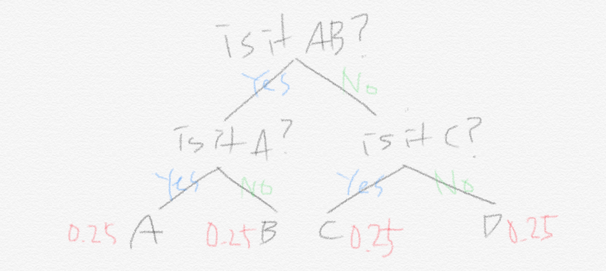
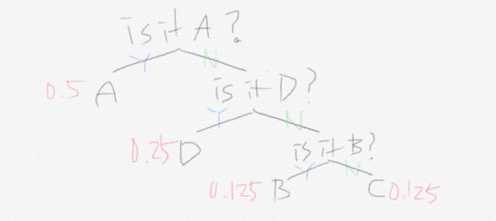
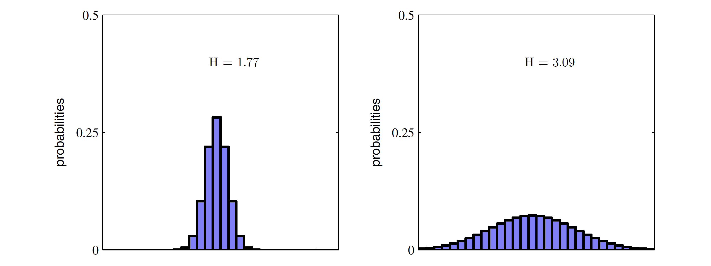

# Entropy ?

- WiKi - [정보 엔트로피](https://ko.wikipedia.org/wiki/%EC%A0%95%EB%B3%B4_%EC%97%94%ED%8A%B8%EB%A1%9C%ED%94%BC)
- Classification 문제에서는 해당 Class인지 아닌지 판단을 위한 `Yes or No` 질문을 하게 됨
- Classing을 위해 필요한 최소한의 질문갯수는 $\log_2(발생가능한\ \ 전체 \ \ 결과의 \ \ 수)$ 와 같음
- 질문갯수를 정보 엔트로피(또는 Shannon Entropy)라고 할 수 있는데, 이는 사건별로 가진 정보의 평균이라고도 함
- 같은 클래스를 생성하는 기계가 아래와 같이 2개 있다고 하자
	- 
	- 
- 기계 Q의 정보 엔트로피
	- $p(A)\cdot2+p(B)\cdot2+p(C)\cdot2+p(D)\cdot2=2$
	- $=0.25\cdot2+0.25\cdot2+0.25\cdot2+0.25\cdot2=2$
- 기계 P의 정보 엔트로피
	- $p(A)\cdot1+p(B)\cdot3+p(C)\cdot3+p(D)\cdot2=1.75$
	- $=0.5\cdot1+0.125\cdot3+0.125\cdot3+0.25\cdot2=1.75$
- 기계 P처럼 모든 사건이 동일한 확률로 일어나지 않을 때, 확률이 높은 경우는 정보가 적고 확률이 낮은 경우 정보가 많음
- 하나의 사건이 확실하게 일어나면 Entropy는 0이 됨
- 즉, Entropy는 모든 사건의 발생 확률이 같을 때 최대가 됨
	- 
- 위에서 처럼 각 기계(확률이 다른 경우) 별로 최적의 질문 방법이 다를 수 있고, 최적의 전략에서 예측을 하는데 필요한 최적의 질문 갯수의 기댓값을 Entropy라고 함
- 따라서 Entropy의 감소 = 질문의 갯수의 감소 = 정보량의 감소

# Cross Entropy ?

- WiKi - [교차 엔트로피](https://ko.wikipedia.org/wiki/%EA%B5%90%EC%B0%A8_%EC%97%94%ED%8A%B8%EB%A1%9C%ED%94%BC)
- 위의 기계 P에 전략 Q를 적용한 경우를 생각해 보자
- 이때의 Entropy는 $0.5\times2+(0.125\times2)\times2+0.25\times2=2$
- 기존의 전략 Q의 1.75 대비 0.25 증가
- 위와 같이 원래의 기계 P의 Entropy와 전략 Q의 Entropy간의 차이를 Cross Entropy라 함
- Cross Entropy 수식
	- $H(p,q) = \sum_i p_i \log_2 {1 \over q_i} = -\sum_{i} p_i \log_2 q_i$

> [!help] Q. Loss Function 으로서의 Cross Entropy는 결국 예측하고자 하는 원래 사건의 이산 확률 분포를 추정하여 각 사건이 일어날 확률과 유사한 분류 질문의 전략을 짜는것인가?

- Binary Classification인 Logistic Regression 에서 사용하는 Loss Function 수식
	- $-y \log \hat y -(1-y) \log (1-\hat y)$
    - 이는 위의 Cross Entropy 수식을 0과 1에 대한 식으로 Sigma를 풀어서 서술한 것
    - 즉, Logistic Regression 에서 사용하는 Loss Function도 Cross Entropy다

# KL Divergence (Kullback-Leibler Divergence)

- WiKi - [쿨백-라이블러 발산](https://ko.wikipedia.org/wiki/%EC%BF%A8%EB%B0%B1-%EB%9D%BC%EC%9D%B4%EB%B8%94%EB%9F%AC_%EB%B0%9C%EC%82%B0)
- 두 확률분포의 차이를 계산하기 위한 함수
- 상대 엔트로피(relative entropy), 정보 획득량(information gain), 인포메이션 다이버전스(information divergence)라고도 함
- 어떤 확률분포(P)에 대해, 그 분포를 근사하는 다른 분포(Q)를 사용해 샘플링을 할 때 발생하는 정보 엔트로피의 차이를 계산함
	- $H(p,q) = -\sum_i p_i \log q_i$
	- $= -\sum_i p_i \log q_i + (\sum_i p_i \log p_i-\sum_i p_i \log p_i)$
	- $= H(p) + \sum_i p_i \log p_i-\sum_i p_i \log q_i$ 
	- $= H(p) + \sum_i p_i \log {p_i \over q_i}$
- 즉, 두 확률분포간 정보량의 차이
	- $D_{KL}(p||q) = H(p) + \sum_i p_i \log {p_i \over q_i}$
	- $= H(p,q) - H(p)$
- p, q에 대한 Cross Entropy에서 p의 Entropy를 뺀 값
- 그러나 여기서 우리는 항상 q에 대해 궁금하기 때문에 Loss Function을 최적화할 때 H(p)는 상수 취급되므로 Cross Entropy와 KLD의 각각의 최적화 결과는 같음
- 두 분포간의 차이지만

# 참고

- [Cross entropy와 KL divergence](https://youtu.be/uMYhthKw1PU)
- [KL Divergence, 순서가 중요할까요?](https://youtu.be/c5nTnvGHG4E)
