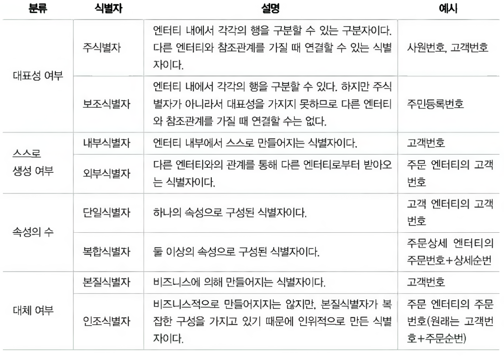

# 데이터모델의 이해

## 모델링의 정의

- 3차원의 현실 세계를 단순화화여 표현하는 것
- 현실 세계를 추상화하여 그 구조를 표현한 것
- 현실에 존재하는 사물이나 사건에 관한 관점 및 양상을 연관된 주체(사람 혹은 그룹)를 위하여 명확하게 하는것
- **즉, 복잡한 현실 세계를 추상화, 단순화, 명확화하기 위해 일정한 표기법으로 모델을 표현**

### 모델링의 특징

| 특징 | 설명 |
| --- | --- |
| 추상화 | 복잡한 현실을 일정한 형식에 맞게 표현하는 것 |
| 단순화 | 복잡한 현실을 서로가 약속한 규약을 준수하는 표기법이나 언어로 표현하는 것 |
| 명확화 | 복잡한 현실을 명확하게 기술하는 것 & 모델을 이해하기 쉽게 애매모호함을 제거하여 표현하는 것 |

## 모델링의 3가지 관점

| 관점 | 설명 |
| --- | --- |
| 데이터 관점 (Data, What) | 비즈니스와 관련된 데이터는 무엇인지 또는 데이터 간의 관계는 무엇인가? 즉, What 에 대한 관점을 의미 |
| 프로세스 관점 (Process, How) | 해당 비즈니스로 인해 일어나는 일은 어떤 일인가? 즉, How 에 대한 관점을 의미 |
| 상관 관점 (Data vs Process) | 데이터 관점과 프로세스 관점 간 서로 어떠한 영향을 받는지에 대한 관점 |

### 데이터 모델링

- 모델링 앞에 데이터가 붙은 것으로
- 현실의 비즈니스를 IT 시스템으로 구현하기 위해 데이터 관점으로 업무를 분석하는 기법
- IT 시스템의 근간이 되는 DB를 구축하기 위한 분석 및 설계의 과정

### 데이터 모델의 기능

| 항목 | 설명 |
| --- | --- |
| 가시화 | 시스템의 모습을 가시화하는 기능 제공 |
| 명세화 | 시스템의 구조와 발생하는 동작을 명세화하는 기능 제공 |
| 구조화된 틀 제공 | 시스템을 구현하기 위해 필요한 구조화된 틀을 제공 |
| 문서화 | 시스템 구축 시 산출물(기록묵)로 사용되는 문서를 제공 |
| 다양한 관점 제공 | 다른 영역의 세부사함을 숨겨 다양한 영역에 집중할 수 있는 관점 제공 |
| 상세 수준의 표현 방법 제공 | 원하는 목표에 따라 구체화된 상세 수준의 표현 방법 제공 |

### 데이터 모델의 중요성

| 이유 | 설명 |
| --- | --- |
| 파급효과 (Leverage) | 비효율적이고 요구사항을 충족하지 못하는 데이터 설계는 개발/테스트/오픈/운영 전 과정에서 엄청난 비용이 발생할 수 있음 |
| 복잡한 요구사항의 간결화 (Conciseness) | 좋은 데이터 모델 설계는 시스템에서 구현해야 할 정보 요구사항을 명확하고 간결하게 표현함 |
| 데이터 품질 (Data Quality) | 잘못된 설계로 데이터의 중복, 비유연성, 비일관성이 발생 가능하며 이로 인해 데이터 품질이 저하될 수 있음 |

### 데이터 모델링의 3단계 진행

| 단계명 | 설명 |
| --- | --- |
| 개념적 데이터 모델링 | 시스템에서 구현 대상에 대해 포괄적 수준의 모델링을 진행. 전사적 데이터 모델링에 주로 사용 |
| 논리적 데이터 모델링 | 시스템에서 구현 대상 비즈니스의 만족을 위한 기본키, 속성, 관계, 외래키 등을 정확히 하는 단계 |
| 물리적 데이터 모델링 | 논리 데이터 모델을 기반으로 물리 DB 구축을 위해 성능, 저장공간 등의 물리적인 특성을 고려하여 설계하는 단계 |

### 데이터 독립성

하위 단계의 데이터 구조가 변경되어도 상위단계에는 영향을 미치지 않는 속성. 즉 데이터 구조가 변경되어도 응용에는 아무런 영향을 미치지 않도록 하는 것.

출현 배경

- 데이터의 복잡도를 낮추고 중복을 줄여 점차 증가하는 시스템의 유지보수 비용을 절감하기 위함
- 사용자 지속적인 요구사항을 충족을 위해 DB와 응용 상호의 독립성을 유지하기 위함

## DB의 3단계 구조

| 단계명 | 설명 | 비고 |
| --- | --- | --- |
| 외부 스키마 (External Schema) | 각 사용자 혹은 응용 개발자가 접근하는 스키마 | 사용자 관점 |
| 개념 스키마 (Conceptual Schema) | 응용 및 사용자들에 필요한 관점들을 통합한 전체 DB를 기술한 것으로 실제 저장되는 데이터와 응용 및 사용자들 간의 관계를 표현한 스키마 | 통합 관점 |
| 내부 스키마 (Internal Schema) | 데이터가 물리적인 하드웨어에 저장되는 방법과 형식을 표현한 스키마 | 물리적 관점 |

## 단계적 구조에서의 데이터 독립성

| 독립성 | 설명 | 비고 |
| --- | --- | --- |
| 논리적 데이터 독립성 | 개념 스키마의 변경이 외부 스키마에 영향없음, 논리적 구조의 변경이 응용에 영향없음 | 사용자 특성에 맞는 변경이 가능, 통합 구조의 변경이 가능 |
| 물리적 데이터 독립성 | 내부 스키마의 변경이 외부/개념 스키마는 영향없음, 저장 장치의 구조 변경이 응용/개념 스키마는 영향없음 | 물리에 영향없이 개념 변경 가능, 개념에 영향없이 물리 변경 가능 |

## 데이터 모델링의 3요소 및 관련 용어

- Things - 업무가 관여하는 어떤 것
- Attributes - Things 가 가지는 성격
- Relationships - 업무가 관여하는 Things 간의 관계

| 개념 | 복수/집합 개념 타입/클래스 | 개별/단수 개념 어커런스/인스턴스 |
| --- | --- | --- |
| 어떤 것 | 엔터티 타입 (Entity Type) | 엔터티 (Entity) |
| (Things) | 엔터티 (Entity) | 인스턴스 (Instance), 어커런스 (Occurrence) |
| 어떤 것 간의 연관 (Association btw Things) | 관계 (Relationship) | 페어링 (Pairing) |
| 어떤 것의 성격 (Characteristic of a Thing) | 속성 (Attribute) | 속성값 (Attribute Value) |

## ERD (Entity Relationship Diagram)

1.  비즈니스에 필요한 엔터티를 그림
2.  과정 1에서 그린 엔터티를 적절하게 배치
3.  각 엔터티 간의 관계를 설정
4.  설정한 관계의 관계명을 기술
5.  설정한 관계의 참여도를 기술
6.  설정한 관계의 필수 여부를 기술

## 좋은 데이터 모델의 요소

| 요소 | 설명 |
| --- | --- |
| 완전성 | 업무에 필요한 데이터가 모두 정의되어야 함 |
| 중복 배제 | 동일한 사실은 단 한 번만 저장해야 함 |
| 업무 규칙 | 데이터 모델 분석만으로도 비즈니스 로직이 이해되어야 함 |
| 데이터 재사용 | 데이터 통합성과 독립성을 고려하여 재사용이 가능해야 함 |
| 의사소통 | 데이터 모델을 보고 관계자끼리 의사소통이 가능해야함 |
| 통합성 | 동일한 데이터는 유일하게 정의해서 다른 영억에서 참조해야 함 |

# 엔터티

## 개념

- 비즈니스 관점에서 통합 관리의 대상으로 시스템에 저장해야 하는 어떤 것(Thing)
- 하나의 엔터티는 다수의 인스턴스를 가질 수 있음 (엔터티-인스턴스는 1:M 관계)
- 
- 엔터티 표기법
- 

## 엔터티의 특징

| 특징 | 설명 |
| --- | --- |
| 업무에 필요 | 비즈니스 요구사항 만족을 위해 반드시 필요, 저장 및 관리하고자 하는 정보여야 함 |
| 식별 가능 | 유일한 식별자에 의해 식별이 가능해야 함 |
| 인스턴스의 집합 | 영속적으로 존재하는 2개 이상의 인스턴스 집합이어야 함 |
| 업무 프로세스가 이용 | 비즈니스 프로세스에 의해 반드시 이용되어야하며 CRUD 등이 발생하지 않는 고립 엔터티는 제거하거나 누락된 프로세스를 확인하여 추가해야함 |
| 속성을 포함 | 반드시 속성이 포함되어야 하며 이름만 있는 경우 관계가 생략되어 있어나 업무 분석이 미진하여 속성 정보가 누락되는 경우에 해당함 |
| 관계의 존재 | 다른 엔터티와 최소 1개 이상의 관계가 있어야 함 |

### 잘못된 엔터티

- 
- 

## 엔터티의 분류

- 유무형에 따른 분류
| 구분 | 예시 | 설명 |
| --- | --- | --- |
| 유형 | 사원, 물품, 강사 | 실체가 존재, 물리적 형태가 있으며 안정적이고 지속적으로 활용 |
| 개념 | 조직, 보험상품 | 물리적 형태는 없지만 비즈니스적으로 관리해야할 개념적 정보 |
| 사건 | 주문, 청구, 미납 | 비즈니스 수행으로 발생되는 엔터티로 유형/개념 엔터티에 비해 발생량이 많고 다양한 통계 자료에 이용될 수 있음 |
    
- 발생시점에 따른 분류
    
| 구분 | 예시 | 설명 |
| --- | --- | --- |
| 기본 | 사원, 부서, 고객 | 비즈니스에서 스스로 태어난 존재에 대한 정보로 타 엔터티와 관계없이 독립적으로 생성가능하며 중심/행위 엔터티의 부모 역할을 함 |
| 중심 | 계약, 사고, 주문 | 기본 엔터티로부터 발생되며 비즈니스의 중심적인 역할로 데이터가 많이 발생되고 타 엔터티와 관계 속에서 많은 행위 엔터티를 도출함 |
| 행위 | 주문목록, 변경이력 | 2개 이상의 부모 엔터티로부터 발생하며 데이터 양이 많을 수 있고 상세 설계 단계 혹은 프로세스와 상관 모델링을 진행하며 도출됨 |

## 엔터티 명명규칙

- 가능한 업무 담당자들이 사용하는 용어 사용
- 가능하면 약어 사용을 지양
- 단순 명사
- 해당 모델 내에서 유일한 이름
- 생성 의미에 부합

# 속성

## 개요

- 비즈니스에 필요하고, 의미적으로 더이상 분리되지 않으며, 엔터티를 설명하는 인스턴스의 구성요소
- 

## 표기법

## 특징

- 비즈니스에 필요하고 IT 시스템에서 저장 및 관리하고자 하는 정보
- 정규화 이론에 따라 속성이 속해 있는 엔터티의 주 식별자에 함수적 종속성을 가짐
- 하나의 속성에는 1개의 값만 가짐. 다중 값일 경우 별도의 엔터티를 이용하여 분리

## 분류

| 특성 | 설명 |
| --- | --- |
| 기본 속성 (Basic Attribute) | 비즈니스 분석을 통해 도출된 속성 |
| 설계 속성 (Designed Attribute) | 비즈니스 분석을 통해 도출되진 않았으나 데이터 모델 설계를 하면서 도출됨 |
| 파생 속성 (Derived Attribute) | 다른 속성에 의해 계산이나 변형이 되어 생성되는 속성 |

## 도메인

- 속성이 가질 수 있는 값의 범위로 각 속성의 속성값은 정의된 도메인 이외의 값을 가질 수 없음

## 명명규칙

- 비즈니스에 사용하는 이름을 부여
- 속성명을 서술식으로 명명하지 않는다
- 약어 사용은 가급적 지양
- 전체 데이터 모델 내에서 유일한 이름

# 관계

## 개요

- 데이터 모델 내의 엔터티 간 논리적 연관성을 의미
- 
- 관계는 인스턴스가 개별적으로 관계를 가지는 것(페어링)의 집합을 표현한 것

## 표기법

- 관계 차수 및 관계 선택사양을 명확하게 해야함
- 관계 차수는 관계에서 참여자의 수를 표현하는 것
	- 
	- 
	- 
- 관계 선택사양
    - 필수참여 관계는 실선으로 표시
    - 선택참여 관계는 점선으로 표시

## 관계 해석

| 기준 | 기준 엔터티 | 관계 차수  | 대상 엔터티 | 필수/선택 | 관계명 |
| --- | --- | --- | --- | --- | --- |
| 각각의 | 고객은 | 여러 개의 | 주문을 | 때때로 | 주문 |
| 하나의 | 주문은 | 한 명의 | 고객을 | 반드시 | 소유 |

# 식별자

## 개요

- 단일 인스턴스를 구별하기 위한 논리적인 이름
- 하나의 속성 혹은 속성들의 조합

## 특징

- 주식별자에 의해 엔터티의 모든 인스턴스가 유일하게 구분되어야 함
- 주 식별자를 구성하는 속성의 수는 유일성을 만족하는 최소의 수
- 자주 변하지 않는 값이며 NULL 불가
- 유일성, 최소성, 불변성, 존재성

## 분류

## 도출 기준

- 비즈니스에서 자주 이용되는 속성을 주식별자로 지정
- 명칭, 장소와 같은 이름 속성은 가능하면 주 식별자로 하지 않음
- 주식별자를 복합식별자로 할 경우 지나치게 많은 속성이 포함되지 않도록 함
- 복합식별자의 속성이 너무 많을 경우 속성의 조합을 하나의 인조식별자로 도출하여 사용
- 
- 

## 식별자 관계 vs. 비식별자 관계

- 부모 엔터티와 자식 엔터티의 관계를 위해 자식 엔터티에 생성되는 속성을 외부식별자라 함
- 이때 자식의 주식별자(식별자 관계)로 할 지, 단순 속성(비식별자 관계)으로 할 지 결정해야함
- 기본적으로는 식별자 관계로 모든 관계를 연결하며 아래 조건에 따라 비식별자 관계로 조정
- 
- 관계 결정 시 고려사항
- 

### 비식별자 관계를 가지는 경우

- 속성이 자식 엔터티에 필수가 아니어서 부모 없는 자식이 생성가능한 경우
- 주식별자로 사용해도 되지만 별도의 주식별자를 생성이 유리하다 판단될 때
- 

### 식별자 관계로만 설정할 경우의 문제

- 관계가 도출될 때마다 PK 속성의 수가 증가함
- 
- 테이블 간 조인 연산 시 조인에 참여하는 식별자 갯수가 많을 수록 복잡도가 상승함
