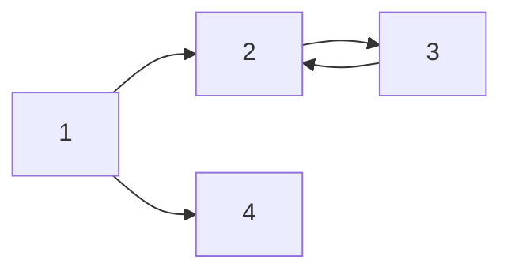

---
### \# 표현

  - # H1 tag

  - ## H2 tag

  - ### H3 tag

  - #### H4 tag

---

### 문자 표현(?)

_italic_

**bold**

**_italic + bold_**

~~cancle~~

> This is Quote

---

### 리스트 표현
- ulist 1
- ulist 2
  - ulist 2-1
  - ulist 2-2

1. olist 1
2. olist 2
  2-1. olist 2-1
  2-2. olist 2-2

---

### 테이블 표현

|Header1|Header2|Header3|
|-|-|-|
|body1|body2|body3|

---

### 링크 및 이미지 표현

- \[링크이름](URL)
[Google](google.com)

- html 방식도 표현해줌
<a href="google.com">Google</a>

- \!\[이미지캡션](이미지경로)

- URL 기반 첨부


- relative path (상대 경로)


---

### 가장 중요한 코드 블럭

this is `inline code` block.

```python
import os

def func:
    print("hello markdown")
    pass
```

참조: GitHub 에서 [지원되는 언어 리스트](https://github.com/github/linguist/blob/master/lib/linguist/languages.yml)

---

### 지원하는 Callout 형식
- quote, cite
> [!cite] 인용
> - 추가 내용
- example
> [!example]- 예제 (접힘)
> \- 를 앞에 넣으면 접히기도 함
- note
> [!note] 노트
- abstract, summary, tldr
> [!tldr] 개요
- info, todo
> [!todo] To-Do
- tip, hint, important
> [!tip] Tip
- success, check, done
> [!done] 성공
- question, help, faq
> [!faq] 의문
- warning, caution, attention
> [!warning] 경고
- failure, fail, missing
> [!fail] 실패
- danger, error
> [!error] 오류
- bug
> [!bug] 버그

---

### LaTex 표현 (MathJax 필요)

$a+b=c$

$a^2_1 + b^2_1 = c^2_1$

it can be $i$nline

$$(\alpha + \beta)^2 = \alpha^2 + 2\alpha \beta + \beta^2$$

---

### 그래프 표현

