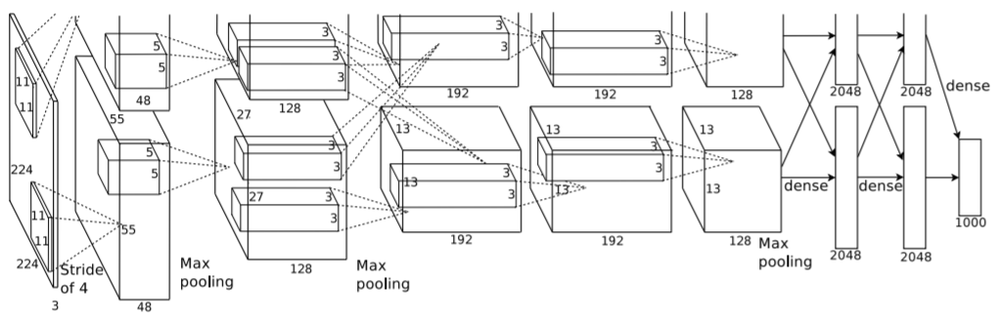
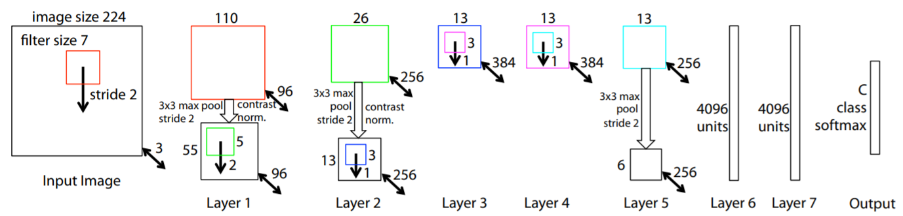
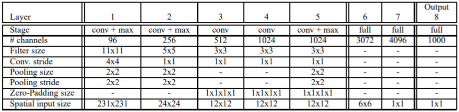
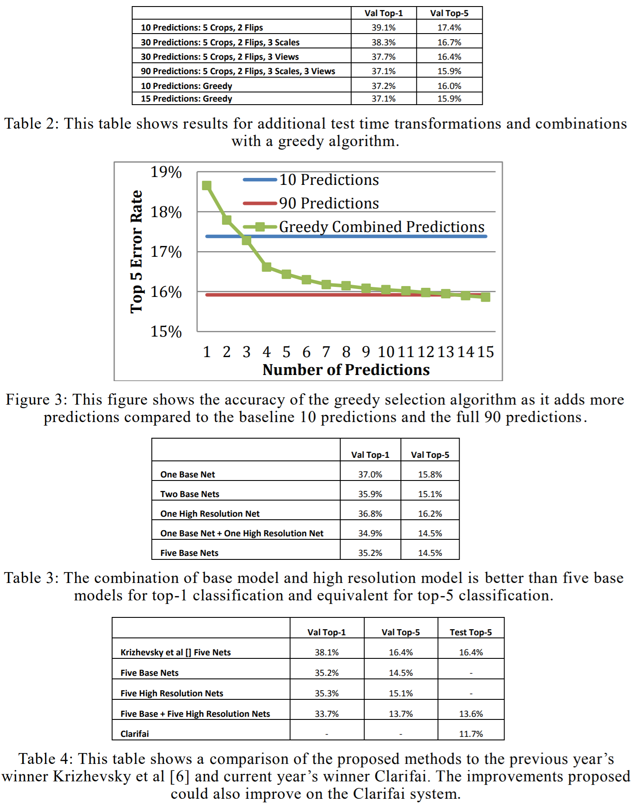
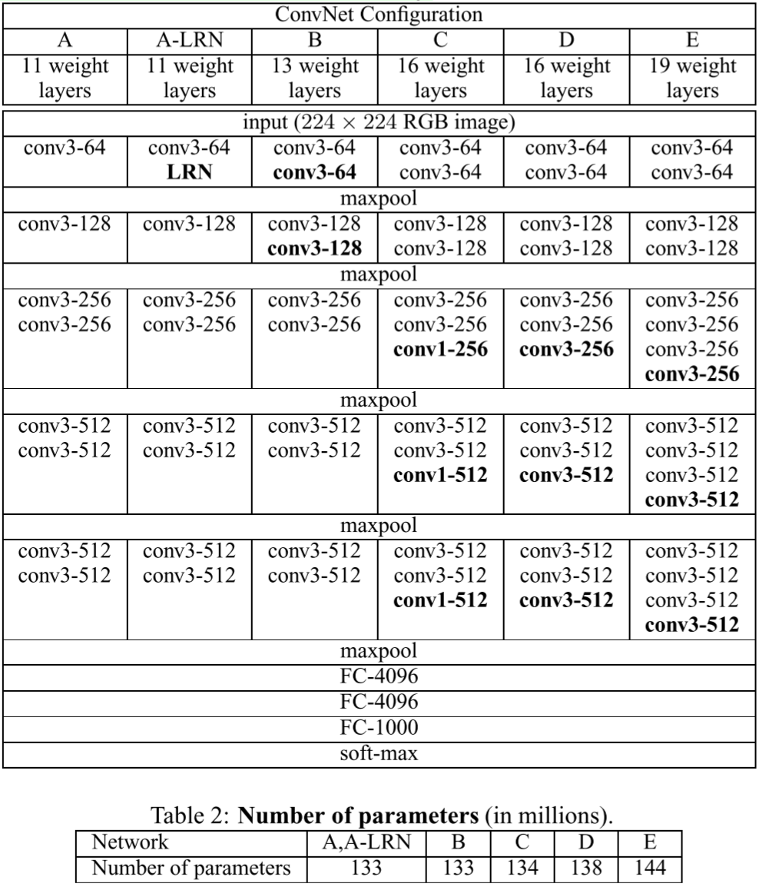

# Abstract

- 목적 : 매우 작은(3x3) conv 필터를 사용하는 네트워크에서 깊이의 증가에 따른 Classification 성능을 평가(evaluation)
- 결론 : 네트워크 깊이를 16~19로 늘리면 상당히 성능이 향상됨
- 이걸로 ImageNet Challenge 2014 에서 localisation, classification 각 분야별로 1, 2위 함

# 1 Introduction

- 2012 ILSVRC에서 Alex Net이 등장
	- [ImageNet Classification with Deep Convolutional Neural Networks](http://papers.nips.cc/paper/4824-imagenet-classification-with-deep-convolutional-neural-networ) - Krizhevsky et al. (2012)
	
- 보다 나은 정확성을 원함
    1) 첫 Conv. Layer에서 더 작은 `window` 와 `stride`를 사용
        - [Visualizing and Understanding Convolutional Networks](https://arxiv.org/abs/1311.2901) - Zeiler & Fergus, (2013)
    
        - [OverFeat: Integrated Recognition, Localization and Detection using Convolutional Networks](https://arxiv.org/abs/1312.6229) - Sermanet et al., (2014)
	
    
    2)  전체 이미지와 다양한 규모에 대해 조밀하게(densly) 학습 및 테스트하기
        - [Some Improvements on Deep Convolutional Neural Network Based Image Classification](https://arxiv.org/abs/1312.5402) - Howard, (2014)
	
- 이 논문에서는 ConvNet 구조의 중요한 측면으로 네트워크의 깊이를 다룸
- 다른 파라미터를 고정(fix)한 상태로 `Conv. Layer` 추가를 통해 네트워크의 깊이만 증가시킴
  - 이는 모든 Layer에서 3x3 `convolution filter`를 사용하기 때문에 가능

# 2 ConvNet Configurations

## 2.1 Architecture

- 입력 학습데이터는 `224 x 244` 고정 크기의 RGB 이미지
- 유일한 전처리는 픽셀 별로 학습데이터 세트의 RGB 평균(mean) 값을 빼는것
- 3x3 `receptive field` ~~(피처맵인가?)~~ 사용
- 1x1 `convolution filter`를 사용한 선형변환
- `Stride` 1
- `Padding` 1 (3x3 `Conv. Layer`의 해상도 유지를 위함)
- 2x2 `window`, `stride` 2의 `Max Pooling Layer`를 총 5개 사용
- `Convolution Layer` 스택 이후 3개의 `Fully-Connected Layer`
    - 1, 2 번은 4096개 채널, 3번째는 1000개의 채널
    - ILSVRC classification 문제가 1000개의 클래스
- FC Layer의 모든 Hidden Layer에 `Activation Function` 으로 `ReLU` 사용
- 마지막으로 `soft-max` Layer
- Alex Net과 다르게 `Local Response Normalisation(LRN)`은 포함하지 않음 (1개의 구조에서만 사용)
    - ILSVRC 데이터에서 성능향상 없이 메모리와 시간을 낭비함

## 2.2 Configuration

- `Conv. Layer`의 채널 수는 64에서 시작, 각 Pooling 후 512에 도달할 때까지 2배씩 증가 이후 동일
  
- 큰 `Conv. Layer`와 큰 `respective field`를 사용한 얕은 네트워크보다 파라미터 수가 많지 않음 (Alex Net은 144M 개)

## 2.3 Discussion

- 첫 번째 `Conv. Layer`에서 다른 네트워크에 비해 상대적으로 큰 `respective field`를 사용하는 대신 전체 네트워크에서 3x3의 `respective field`를 사용함
- 2개의 3x3 `Conv. Layer`는 5x5 `respective field`의 효과이며, 3개는 7x7의 효과를 가짐
- 그러면 3개의 3x3 `Conv. Layer` 중첩은 어떤 효과가 있나?
    1. 하나의 `결정함수(decision function)` 보다 비선형 `Rectification Layer` 3개를 쌓아 더 잘 구분(discriminative)함
    2. 파라미터를 줄임
        - 3개의 3x3 `Convolution Layer` 스택의 파라미터 수
          $3(3^2C^2) = 27C^2$ ($C$는 Channel의 수)
        - 1개의 7x7 `Convolution Layer`의 파라미터 수
	      $7^2C^2 = 49C^2$ ($C$는 Channel의 수)
        - 약 81% 가량 더 많은 파라미터를 필요로 함
- 1x1 `Conv. Layer`의 추가는 `Respective Field`의 영향을 주지 않고 결정함수에 비선형성을 증가시킴
    - 기본적으로 1x1 자체는 선형변환이나 `rectification 함수`~~(활성함수?)~~의 추가로 네트워크의 비선형성이 증가
- 또한 깊은 네트워크를 사용하여 좋은 성능을 보이는 Goodfellow et al. (2014), GoogLeNet (Szegedy et al., 2014) 이 있음
- 본 논문의 네트워크는 Single-Network Classification에서 정확도가 뛰어남

# 3 Classification Framework

## 3.1 Training

- 학습 방법은 일반적으로 Alex Net을 따름
- `Objective Function`~~(Loss Function?)~~은 `다항 로지스틱 회귀(Multinomial Logistic Regression)`을 최적화
- 최적화 방법으로 `모멘텀`이 있는 역전파 기반의 미니 배치 `경사하강법`을 사용
    - 첫 번째, 두 번째 FC Layer 에서 가중치 감소(weight decay) 및 dropout으로 정규화
    - $L_2$ 패널티 승수(Penalty Multiplier) $5\cdot10^{-4}$
    - `Batch Size` 256
    - `Momentum` 0.9
    - `Dropout` 0.5
    - 초기 `Learning Rate` $10^{-2}$ 로 설정, 이후 학습 시 개선이 멈추면 10배 감소
        - 최종적으로 3배 감소, 370K iterations (74 epochs).
    - Alex Net에 비해 더 많은 파라미터와 더 깊은 네트워크를 가지지만 더 적은 epoch로 목포 수렴이 가능하다고 추측됨
    - A 네트워크 학습 시 가중치는 랜덤으로 초기화
    - 모든 네트워크 구성 시 앞에 4개의 `Convolution Layer` 와 뒤에 3개의 `FC Layer` 는 A 네트워크와 동일하게 적용, 이외의 중간 부분은 랜덤으로 초기화
        - Pre-initialised Layer의 `Learning Rate` 는 따로 줄이지 않아 학습 중 변경될 수 있음
        - 랜덤 초기화는 평균 0, 분산이 $10^{-2}$ 인 정규분포에서 샘플링
        - `Bias` 0
    - 학습 데이터를 무작위로 224x224 크기로 자름 (1 Stochastic Gradient Descent, Iteration당 이미지 별로 1회 crop)
    - 훈련 이미지를 `isotropically-rescale` 할 때 가장 작은 값을 `S` 라 칭함. 이는 `Training Scale` 라고 함
        - `S = 224` 인 경우, 학습 이미지 전체의 통계를 Capture
        - `S` 값이 매우 커지면 작은 Object 또는 Object의 부분을 Capture
    - Training Scale 값을 위한 접근 방식
        1. `S` 고정 (to fix S)
            - 단일 Scale 학습에 해당
            - 샘플링된 Crop 이미지는 여전히 다중 스케일 이미지의 통계를 나타낼 수 있음...?
            - 본 실험에서 `S = 256`과 `S = 384` 인 경우를 평가함
            - `S = 256` 을 먼저 학습 후 `S = 384` 의 초기 가중치로 사용하고 Learning Rate를 더 작은 $10^{-3}$ 으로 설정
        2. 랜덤 추출된 샘플 별로 각각 `S` 를 조정
            - 다중 Scale 학습에 해당
            - `S`는 $[S_{min}, S_{max}]$ 범위에서 무작위로 선택 (본 실험의 $S_{min} = 256$, $S_{max} = 512$)
    - 학습 시 이미지의 사이즈가 다를 수 있음을 고려하는 것이 좋음
        - 이는 학습에 Jittering~~(노이즈?)~~을 줘서 단일 모델이 더 넓은 범위의 스케일을 인식하도록 함
    - 학습 속도를 위해 `S = 384` 인 기 학습된 단일 스케일 모델을 `fine-tuning` 하여 멀티 스케일 모델을 학습함

## 3.2 Testing

- 테스트 방법
    1. 미리 정의된 `isotropically-rescale` 를 위한 Test Scale 값인 `Q` 로 입력 이미지 변환
        - Train Scale `S` 와 Test Scale `Q` 는 반드시 같지 않아도 됨
        - 오히려 `S` 에 대해 여러 `Q` 를 사용하면 성능이 향상됨
    2. 첫 번째 FC Layer는 7x7 Conv. Layer 가 적용되고, 마지막 2개의 FC Layer는 1x1 Conv. Layer 가 적용
    3. 결과는 입력 이미지 크기에 따른 공간 해상도와 클래스 별 score map
    4. score map을 공간적으로 평균화(sum-pool) 하여 이미지에 대한 클래스 점수의 고정 벡터를 구함
    5. 수평으로 이미지를 뒤집어 테스트 세트를 확장하고 원본과 뒤집힌 이미지의 `Soft-Max` 값의 posterior 들을 평균하여 최종 점수 계산
- Fully-Convolutional 네트워크는 이미지 전체에 적용되기 때문에 테스트 시 다중으로 Crop한 샘플링이 필요 없음 오히려 Crop 별로 네트워크의 재계산이 요구되므로 비효율적
- Szegedy처럼 대량의 Crop 세트를 사용하면 입력 이미지의 더 미세한 샘플링이 가능하므로 Fully-Convolutional 네트워크에 비해 accuracy를 향상시킬 수 있음
    - [Going Deeper with Convolutions](https://arxiv.org/abs/1409.4842) - Szegedy et al. (2014) [pdf](https://arxiv.org/pdf/1409.4842.pdf)
- 또한 multi-crop evaluation은 다양한 Convolution 경계 조건에 대해 dense evaluation을 보완할 수 있음
- Crop에 대해 ConvNet을 적용하는 경우 Convolved Feature Map 은 0으로 채워지고 Dense Evaluation 동안 패딩은 이미지의 주변에서 자연스럽게 나오기 때문에 대체로 네트워크의 Receptive-Field가 크게 증가하고 더 많은 Context가 캡쳐됨

## 3.3 Implementation Details

-   생략

# 4 Classification Experiments

- Dataset : ILSVRC-2012 dataset
    - 1000개 Class
    - 1.3M 학습 이미지
    - 50K 검증 이미지
    - 100K 테스트 이미지
- 성능 측정 방법 : top-1 & top-5 error

## 4.1 Single Scale Evaluation

a

## 4.2 Multi-Scale Evaluation

a

## 4.3 Multi-Crop Evaluation

a

## 4.4 ConvNet Fusion

a

## 4.5 Comparison with The State of the Art

a

# 5 Conclusion

- 네트워크의 깊이는 분류 정확성에 도움이 되며 대체로 깊은 네트워크들이 챌린지에서 state-of-the-art를 달성함

# Appendix

a

# Questions

Q. `Prior-art`란?

Q. `Respective Field` vs. `Convolution Filter` vs. `Conv. Layer` vs. `Feature Map` vs. `Rectification Layer`

Q. kernel size vs. filter size vs. window size vs

```python
def Conv2D(filters, kernel_size, strides=(1, 1), padding='valid',
		   data_format=None, dilation_rate=(1, 1), groups=1,
		   activation=None, use_bias=True,
		   kernel_initializer='glorot_uniform',
		   bias_initializer='zeros',
		   kernel_regularizer=None, bias_regularizer=None,
		   activity_regularizer=None, kernel_constraint=None,
		   bias_constraint=None, **kwargs)
```

Q. `Objective Function` vs. `Loss Function` vs. `Cost Function`

Q. `Spatial`의 직관성? 느낌?

Q. Introduction 의 필터 사이즈가 다르면 새로운 Layer 추가가 어려운 것인가?

Q. 평균(mean)값을 빼는 정규화로 RGB값이 음수가 되면?

Q. 보통 채널 갯수를 Class 별로 가져가는지?

Q. `isotropically-rescale` 의 `S` 값?

-   쉽게 말해 원본의 종횡비가 유지되는 ~~가장 작은~~ 경우의 값...?
-   300x300 → 224x224 일 때, `S` 는 224
-   200x300 → 100x150 일 때, `S` 는 100...?

# Refer to

- [Very Deep Convolutional Networks for Large-Scale Image Recognition](https://arxiv.org/abs/1409.1556)
