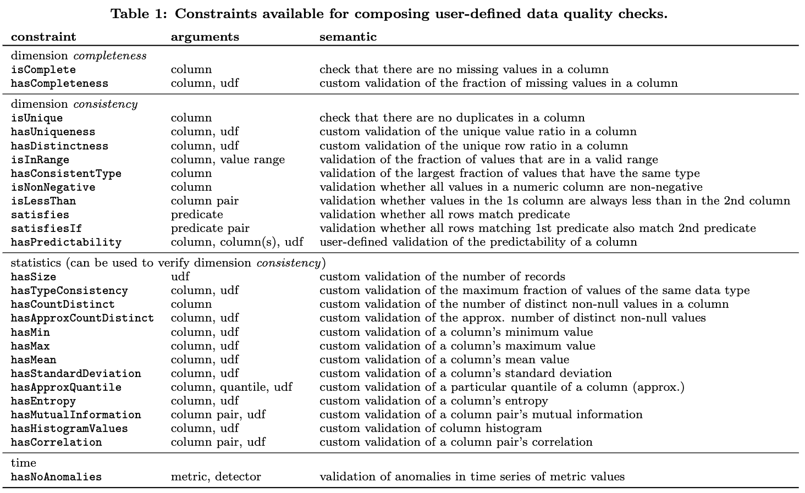
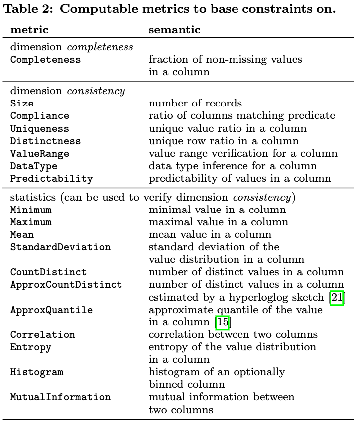

# Abstract

- 데이터에 대해 `공통적인 품질 제약`(Common Quality Constraints)과 `사용자 정의 검증 코드`(User-defined Validation Code)를 결합한 단위 테스트를 가능하게 하는 API를 제공하고, 이를 통해 제품 수준의 요구사항을 충족하는 대규모 데이터 품질 검증 자동화 시스템을 제시

# Introduction

- 최근 산업계는 여러 분야에 걸쳐 기계학습을 활용 중이지만, 해당 기술은 입력 형태에 강한 가정(Strong Assumptions)이 깔려있고, 간혹 값에 매우 민감한 모델도 있음
- 좋은 성능의 모델을 만들기 위해 많은 양의 데이터가 필요하다는 증거가 많음
- 본 시스템의 핵심 원칙? 가치?
    - 선언성 (Declarativity), 유연성 (Flexibility), 확장성 (Scalability)
- 선언성
    - 사용자가 품질 검증 보다 데이터가 "어떻게" 표시되어야 할지 더 신경 쓰게 하기
    - 따라서, 사용자는 다양한 제약 조건을 정의하고 이를 통해 데이터를 검증할 수 있는 API를 제공
    - 최종 비전은 사용자가 SW 엔지니어링의 관행과 유사하게 데이터에 대한 '단위 테스트'를 작성 가능하게 함
- 유연성
    - 외부 데이터 및 사용자 정의 코드를 활용할 수 있어야 함
    - 일부 데이터를 REST의 결과를 가지고 연산된 다른 통계 값들과 비교하는 복잡한 기능이 가능해야 함
- 확장성
    - 데이터는 계속 증가할 것이므로 이 모든 것들을 포괄하여 처리 할 수 있어야 함
    - 이를 위해 요구되는 데이터 메트릭 계산을 집계 쿼리(aggregation queries)로 변환하도록 설계
    - Apache Spark와 같은 분산 dataflow 엔진을 사용하여 대규모 처리
- 품질 검증에 기계학습을 활용하는 방법과 예를 제공
    - enhancing constraint suggestions
    - for estimating the predictability of column
    - for detecting anomalies in historic data quality timeseries

# Data Quality Dimensions

- 데이터의 품질은 데이터의 확장과 의도 파악에 참조가 될 수 있음
- 데이터의 완전성에 입각해서 품질을 측정
    - 예를 들어 값이 없는 속성이 있다면 missing 으로 간주
- Data Quality 지표로 참조될 만한 것들
    - 완전성 (Completeness)
    - 일관성 (Consistency)
    - 정확성 (Accuracy)
        - 문법적 정확성 (Syntactic Accuracy)
        - 의미적 정확성 (Semantic Accuracy)
    - refer to
		- [Methodologies for data quality assessment and improvement](https://dl.acm.org/doi/abs/10.1145/1541880.1541883)
		- [Quality-Driven Query Answering for Integrated Information Systems](https://link.springer.com/book/10.1007/3-540-45921-9)
		- [Data quality under the computer science perspective](https://www.academia.edu/2746633/Data_quality_under_the_computer_science_perspective)

## 완전성 (Completeness)

- Entity가 real-world의 객체를 설명하는데 필요한 데이터의 포함 정도
- 관계형 DB 시스템의 테이블에서 완전성은 보통 Missing value로 해석하는 Null 값의 존재로 측정 가능
    - 그러나 단순히 Missing value의 부재가 아닌 올바른 context에서 측정하는 것이 중요
    - 예를 들면... shoe_size 속성의 부재는 notebook 카테고리와 관계가 없음 → 적용 불가한 속성이기에 Missing value 이니까...
- 즉, 적용 가능한 속성에 대해서만 완전성을 측정해야 함

## 일관성 (Consistency)

- 의미 규칙(Semantic Rules)이 위반되는 정도
- Intra-relation Constraints는 허용 가능한 값의 범위를 정의함
    - 데이터 타입, 숫자형 컬럼의 간격, 범주형 컬럼의 값 set 등
    - 하나의 Constraint에 많은 테이블, 많은 컬럼이 포함될 수 있음

## 문법적 정확성 (Syntactic Accuracy)

- 값의 표현을 해당되는 정의 도메인(Definition Domain)과 비교
- e.g. 1) 색깔의 경우, 주어진 도메인에 따라 빨간색은 올바른 값이고 파란색은 틀린 값이 될 수 있음
- e.g. 2) 사이즈의 경우, 주어진 도메인에 따라 XL의 값이 틀린 값이 될 수 있음

## 의미적 정확성 (Semantic Accuracy)

- 값의 표현을 실제(Real-World)와 비교
- e.g. 1) 색깔의 경우, 빨간색, 파란색 모두 올바른 의미를 가짐
- e.g. 2) 사이즈의 경우, XL 자체는 의미가 없음

# Approach

## 데이터에 대한 Unit Test

- 기본적인 아이디어는 사용자가 선언적 방식(declarative manner)으로 Datasets에 대한 단위 테스트를 쉽게 정의할 수 있게 하는 것
	- [Data Cleaning | Proceedings of the 2016 International Conference on Management of Data](https://dl.acm.org/doi/abs/10.1145/2882903.2912574)
- 단위 테스트는 사용자 정의 함수와 결합하여 데이터에 대한 제약(Constraint)이 구성됨
    - 결측치, 중복 컬럼에 대한 확인 및 간단한 값 검증(유효 범위, 음수, 등)을 기본 제공
    - 사용자 정의 함수를 추가 할 수 있으나 꽤나 제한적인(?) 목적으로만 사용 가능해 보임
    - 
    - API를 활용한 데이터 품질 검증 코드 예시
        ```javascript
        /*
         *  동영상 스트리밍 서비스에서 사용자의 정보를 로깅하고 수집하는 경우
         *  수집 프로세스를 시작하기 전에 API를 활용하여 데이터의 품질을 확인가능
         *  일련의 검증 프로세스를 파이프라인화 시켜 단위 테스트처럼 수행
         */
        
        // 전체 영화 수를 결정하기 위해...?
        // 외부 API 서비스 호출 
        val numTitles = callRestService(...)
        // 휴대폰 시청자의 예상 비율을 계산
        val maxExpectedPhoneRatio = computeRatio(...)
        
        var checks = Array()
        
        checks += Check(Level.Error)
          // 완전성(Completeness) 검증
          .isComplete("customerId", "title", "impressionStart", "impressionEnd",
             "deviceType", "priority")
          // 고유성 검증
          .isUnique("customerId", "countryResidence", "deviceType", "title")
          // 고유한 제목의 수가 시스템 전체 영화보다 많지 않은지 검증
          .hasCountDistinct("title", _ <= numTitles)
          // 휴대폰 시청 비율이 기대치를 충족하는지 검증
          .hasHistogramValues("deviceType",
            _.ratio("phone") <= maxExpectedPhoneRatio)
        
        // 일관성 검증
        checks += Check(Level.Error)
          // 컬럼의 음수값 존재여부 검증
          .isNonNegative("count")
          // 타임스탬프 간 관계 검증
          .isLessThan("impressionStart", "impressionEnd")
          // 유효값 검증
          .isInRange("priority", ("hi", "lo"))
        
        // Time-Series 데이터에 대한 이상 감지
        checks += Check(Level.Warning, on="delta")
          .hasNoAnomalies(Size, OnlineNormal(stdDevs=3))
        checks += Check(Level.Error , on="delta")
          .hasNoAnomalies(Size, OnlineNormal(stdDevs=4))
        
        // 99% 정밀도(precision)로 열 값을 예측가능한지 검증
        checks += Check(Level.Warning)
          .hasPredictability("countryResidence",
            ("zipCode", "cityResidence"), precision=0.99)
        
        Verification.run(data, checks)
        ```
- 사용자가 정의한 제약사항을 보다 효율적으로 실행 가능한 metric 연산으로 변환하도록 설계
- Time-Series 데이터에 대한 자동적인 이상 감지는 시간이 지남에 따라 축적된 데이터가 이전 mean에서 표준편차가 $3\sigma$ 보다 큰 경우 경고 발생, $4\sigma$보다 큰 경우 에러 발생

## 제약 조건 정의의 metric 계산으로의 변환

- 제약사항은 특정 데이터 품질 지표에 의존함
- 시스템은 제약사항과 검증방식을 검사(inspect)하고 검증방식의 평가에 요구된 지표(metric)를 수집함
- 
- 지표(metric) 계산
    - 데이터 세트 $D$
    - 처리하는 레코드 갯수 $N$
    - 데이터 세트 $D$의 특정 컬럼 $v$ 의 농도(cardinality) $c_v$
    - 데이터 세트 $D$의 특정 컬럼의 고유값 세트 $V$
    - 제약사항 → 지표 연산 변환 방법 (detail)
        - 완전성(Completeness)은 컬럼에 있는 비결측값(non-missing value)의 비율을 계산
	        - $\left| \left\{ d \in D \mid d \left( col \right) \neq null \right\} \right| / N$
        - 일관성(Consistancy) 측정을 위해 고유 값의 수, 데이터 유형, 데이터 셋의 크기, 값의 범위 및 일반적인 일치 지표(general predicate matching metric)를 제공
            - Size 지표는 전체 레코드의 갯수 $N$
            - Compliance 지표는 특정 조건을 충족하는 레코드의 비율
	            - $\left| \left\{ d \in D \mid p(d) \right\} \right| / N$
            - Uniqueness 지표는 컬럼의 고유한 값의 비율
	            - $\left| \left\{ v \in V \mid c_v = 1 \right\} \right|/|V|$
            - Distinctness 지표는 컬럼의 고유한 행의 비율 (Distinctness corresponds to the unique row ratio $|V| / N$ in the column) ~~컬럼의 고유한 행이 무슨 말이지..?~~
	            - $|V|/N$
            - 숫자형에 대해 표준적 통계 요약 제공 (e.g. 최솟값, 최댓값, 평균, 표준 편차, 히스토그램 및 엔트로피)
	            - $-\sum_v {c_v \over N} \log {c_v \over N}$ (엔트로피 계산식)
            - Correlation 과 MutualInformation로 두 컬럼 간 연관 정도 측정 방법을 제공
	            - $\sum_{v_1} \sum_{v_2} {{c_{v_1v_2}} \over N} \log {{c_{v_1v_2}} \over {c_{v_1v_2}}}$ (Mutual Information 계산식)
            - 재분할(re-partitioning), 정렬 등 계산에 많은 비용이 필요한 몇몇 지표를 위해 근사치 추정 제공
                - ApproxQuantile : 효율적인 온라인 알고리즘으로 계산
                - ApproxCountDistinct : [hyperloglog](https://en.wikipedia.org/wiki/HyperLogLog) 스케치가 있는 고유 값의 갯수
            - 컬럼의 Predictability 측정
                - (원문)
                    In an attempt to automate the verification of the correctness of values, we train a machine learning model that predicts a value for a target column $t$ of a particular record from all $k$ observed values $l_1, ..., l_k \in V_t$ in the target column, given the corresponding values $l_{i_1}, ..., l_{i_n}$of input columns $i_1, ..., i_n$for the particular record, e.g., using the maximum a posteriori decision rule: $\arg\max_k p(l_k|l_{i_1}, ..., l_{i_n})$
                - 타겟 컬럼 $t$에 대해 레코드에 존재하는 고유한 값 $l_k$의 집합 $V_t$ 와 주어진 입력 값 $l_{i_n}$이 일치하는지 예측하는 ML모델을 학습시킴
                - Maximum a posteriori decision rule을 사용
	                - $\arg\max_k p(l_k|l_{i_1}, ..., l_{i_n})$
                - 예측 정밀도를 recall 또는 F1 스코어 같은 표준 측정 값으로 계산하여 품질 점수로 반환
- 위와 같이 데이터 품질에 대한 검증을 실시한 후 계산된 지표들의 값과 실패한 지표에 대한 리포팅을 함
- 리포트 예시
```javascript
...
Success("isComplete(title)", Completeness("title") == 1.0)),
Success("isNonNegative(count)", Compliance("count >= 0") == 1.0)),
Failure("isUnique(customerId, countryResidence, deviceType, title)",
  Uniqueness("customerId", "countryResidence", "deviceType", "title") == 1.0,
  0.9967),
Failure("isInRange(priority, (‘hi’, ‘lo’))",
  Compliance("priority IN (‘hi’, ‘lo’)") == 1.0,
  0.833),
...
```
    - 제공되는 품질 지표로 isComplete(title)을 선택한 결과 내부적으로 Completeness("title") == 1.0 로 변환되어 연산이 진행됨
    - Unique 제약사항의 지표는 99.67% 정도의 데이터만 고유한것으로 해석
    - Compliance 제약사항의 지표는 83.3% 가량의 데이터만 범위 안에 속하는 것으로 해석
